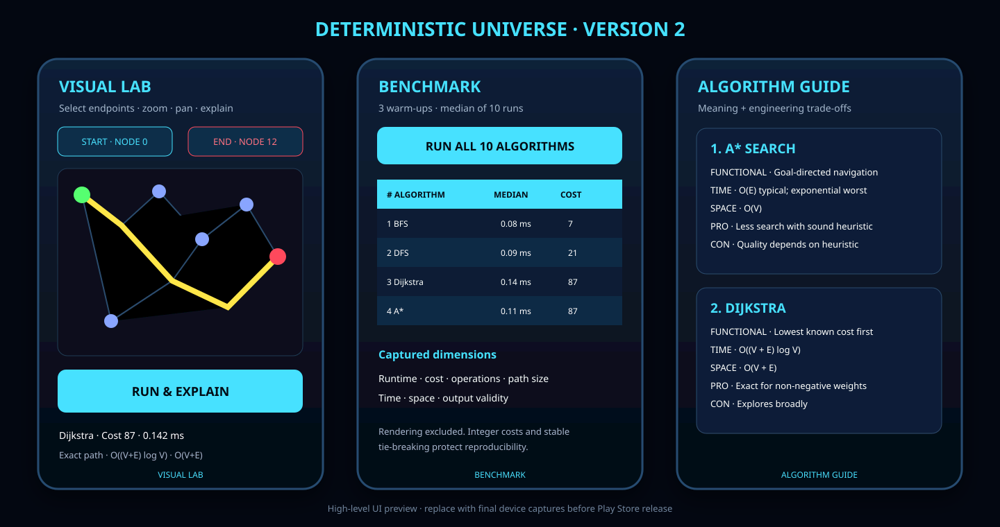

# Deterministic Universe v2

**An offline Android laboratory for playing with, visualizing, explaining and benchmarking deterministic graph algorithms.**

> **Product goal:** make algorithm behaviour visible and measurable, then evolve the project from a reproducible engineering portfolio into a polished educational app on Google Play.



_High-level preview of the three Version 2 tabs. Replace this with final phone and tablet captures after release-candidate testing._

## Why this project exists

Most algorithm demos show only a final path or one runtime. Deterministic Universe combines interaction, visual reasoning, technical explanation and controlled measurement. A learner can select endpoints, run the same graph through ten engines, understand why the result was selected and compare cost, work and complexity without network access.

## Three-tab experience

| Tab | User experience | Engineering value |
|---|---|---|
| **Visual Lab** | Select start/end dots, zoom, pan, run an algorithm and inspect the highlighted solution. | Separates execution from rendering and explains cost, operations, runtime, time complexity and space complexity. |
| **Benchmark** | Run all ten engines on the same graph and inspect a structured table. | Uses 3 warm-ups and 10 measured runs; reports median runtime, cost, operation count, path size and validity. |
| **Algorithm Guide** | Read functional and technical descriptions for every engine. | Covers purpose, complexity, optimality, output cost, strengths, limitations and recommended use cases. |

## Included deterministic engines

| Algorithm | Primary problem | Time | Space | Guarantee / output |
|---|---|---:|---:|---|
| Breadth-First Search | Unweighted shortest path | `O(V + E)` | `O(V)` | Shortest hop path |
| Depth-First Search | Reachability and traversal | `O(V + E)` | `O(V)` | Not shortest-path optimal |
| Dijkstra | Non-negative shortest path | `O((V + E) log V)` | `O(V + E)` | Exact shortest path |
| A* | Goal-directed shortest path | Typical `O(E)`; exponential worst case | `O(V)` | Exact with an admissible, consistent heuristic |
| Bidirectional Dijkstra | Point-to-point shortest path | `O((V + E) log V)` | `O(V)` | Exact with a correct stopping rule |
| Bellman–Ford | Shortest path with negative edges | `O(VE)` | `O(V)` | Exact without reachable negative cycles |
| Floyd–Warshall | All-pairs shortest paths | `O(V³)` | `O(V²)` | Exact without negative cycles |
| Kruskal | Minimum spanning forest | `O(E log E)` | `O(V + E)` | Minimum total spanning cost |
| Prim | Minimum spanning tree | `O(E log V)` | `O(V + E)` | Minimum total spanning cost |
| Topological Sort | DAG dependency ordering | `O(V + E)` | `O(V)` | Valid ordering and cycle detection |

## Determinism contract

- Fixed graph seed and stable node/edge identifiers.
- Stable priority ordering with node-ID tie-breaking.
- Integer edge costs prevent floating-point route drift.
- Identical input, endpoints and settings produce the same ordered output.
- Rendering time is excluded from engine timing.
- Unit tests replay every algorithm 100 times and compare path plus cost.
- Device timings may vary; determinism guarantees output consistency, not identical wall-clock time.

## Architecture

```text
Android Activity / three-tab UI
├── Interactive Canvas (touch, pan, pinch zoom)
├── Benchmark Table (warm-up, measurement, validation)
├── Algorithm Guide (functional + technical metadata)
└── Pure Java Algorithm Engine
    ├── Immutable graph model
    ├── Stable ordered traversal
    └── Deterministic result object
```

| Area | Choice |
|---|---|
| Language | Java 17 |
| UI | Native Android Views and Canvas |
| Minimum Android | Android 10 / API 29 |
| Target / compile SDK | 35 |
| Build | Android Gradle Plugin 8.7.3; Gradle 8.9 |
| Dependencies | Minimal; JUnit for unit tests |
| Privacy | Offline-first; no account, ads, analytics or sensitive permissions |

## Benchmark interpretation

Runtime alone cannot identify a universally “best” algorithm. Interpret it with graph type, correctness conditions, path cost, operation count, memory complexity and intended problem. Minimum-spanning-tree and topological-order outputs are not directly comparable to shortest paths; the app presents them together for learning, not to imply identical semantics.

## Build and validation

Requirements: JDK 17, Android SDK 35 and Gradle 8.9.

```bash
gradle clean testDebugUnitTest lintDebug assembleDebug
```

The test APK is generated at `app/build/outputs/apk/debug/app-debug.apk`. Every push to `main` triggers GitHub Actions to run unit tests, lint and a debug build. The APK is retained as the `DeterministicUniverse-test-apk` workflow artifact.

## Google Play goal and release roadmap

| Stage | Exit criteria |
|---|---|
| **Internal testing** | Validate endpoint selection, gestures, tables and navigation on multiple Android screen sizes. |
| **Quality hardening** | Instrumentation tests, accessibility checks, battery/memory profiling and benchmark baselines. |
| **Store assets** | Launcher icon, feature graphic, real phone/tablet screenshots, listing text and hosted privacy policy. |
| **Release engineering** | Private upload keystore, signed Android App Bundle, Play App Signing, reproducible release build and changelog. |
| **Play Console** | Accurate Data safety, content rating, target audience, ads, app access and privacy declarations. |
| **Production** | Closed-test feedback resolved, no critical defects, staged rollout and post-release monitoring. |

The current debug APK is intended for local testing. Google Play requires a release-signed `.aab`, publisher-controlled credentials, production assets and Play Console approval.

## Privacy and security

- No internet permission, account or analytics SDK.
- No personal data is collected or transmitted.
- Graphs and benchmarks are processed on-device.
- Signing keys and credentials are excluded via `.gitignore` and must never be committed.
- See [Privacy Policy](PRIVACY_POLICY.md) and [Play Store Checklist](PLAY_STORE_CHECKLIST.md).

## Licensing

The source is released under the **MIT License**; see [LICENSE](LICENSE). It permits use, modification, distribution and commercial use when the copyright and license notice are retained.

Before publishing:

- Audit future dependencies and include all required notices.
- Confirm that icons, fonts, screenshots and graphics are original or properly licensed.
- Do not interpret MIT as a warranty, trademark grant or endorsement.
- Keep publisher branding and signing credentials under publisher control.

## Responsible positioning

This is an educational and engineering application. Device timings are illustrative, not scientific cross-device benchmarks. The project does not claim that one algorithm is universally superior; selection depends on graph structure, edge constraints, memory budget and required guarantees.

## Roadmap beyond v2

- Animated frontier and visited-node playback with pause and single-step controls
- Editable weighted grids, obstacles and reproducible scenario import/export
- Larger datasets with percentile and memory measurements
- CSV, JSON and PDF report export
- Colour-independent accessibility patterns and tablet optimization
- Signed release bundle and Google Play internal-testing launch

---

**Status:** Version 2 compiles through GitHub Actions and produces a test APK. Contributions should preserve deterministic output, test coverage and offline-first privacy.
